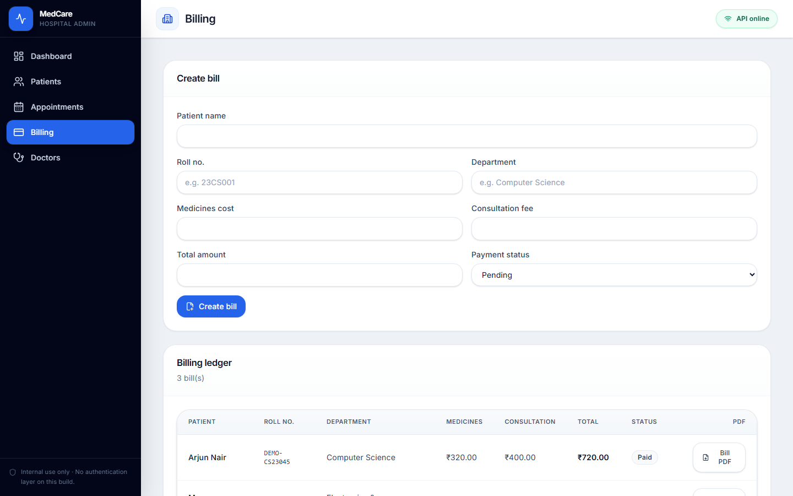
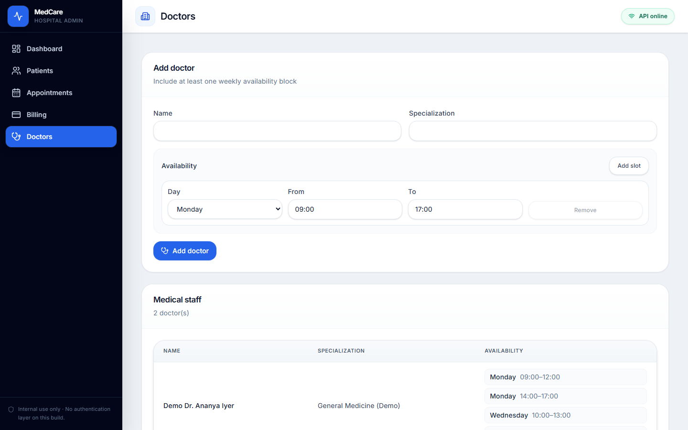

# MedCare

MedCare is a hospital administration web application for managing patients, appointments, billing, and medical staff. It provides validated data entry, a dashboard with charts, and server-generated PDF documents for prescriptions and invoices.

This repository is a learning and demonstration project. The current build does not include user authentication or role-based access control.

## Features

- Patient registration and directory with search, optional prescription PDF download, and structured medicines with dosage
- Student-oriented fields: roll number and department on patients, appointments, and bills (validated where required)
- Appointment scheduling with status updates
- Billing ledger with totals validation and bill PDF export
- Doctor directory with weekly availability blocks
- Dashboard summarizing patient volume, revenue, appointment mix, and recent activity
- REST API backed by MongoDB with consistent JSON responses

## Screenshots

The images below were captured from a running MedCare UI after [demo data](#demo-data-for-testing) was loaded. They show the dashboard, patient directory (with structured prescriptions), appointments, billing, and doctors.

| Dashboard | Patients |
| :---: | :---: |
|  |  |

| Appointments | Billing |
| :---: | :---: |
|  |  |

| Doctors |
| :---: |
|  |

### Regenerating screenshots

You can point the capture script at **any reachable URL** (local Vite dev server, preview, or a deployed site):

```bash
cd client
npm install
npx playwright install chromium
cd server
npm run seed:demo
```

In one terminal, run the API (`cd server && npm run dev`) and the client (`cd client && npm run dev` or `npm run preview` after a build). Then:

```bash
cd client
# Default is http://localhost:5173 — override if Vite picked another port or you use production.
npm run readme:screenshots
```

Override the base URL when needed:

- **cmd.exe:** `set MEDCARE_SCREENSHOT_URL=http://localhost:5174`
- **PowerShell:** `$env:MEDCARE_SCREENSHOT_URL="https://your-live-site.example"`
- **macOS / Linux:** `export MEDCARE_SCREENSHOT_URL=https://your-live-site.example`

Then run `npm run readme:screenshots` from `client/`. Files are written to `docs/screenshots/`.

## Architecture

| Layer | Technology |
| --- | --- |
| Client | React 19, React Router 7, Vite 8, Tailwind CSS 4, React Hook Form, Zod, Axios, Recharts |
| Server | Node.js (ES modules), Express 4, Mongoose 8 |
| Database | MongoDB (local or MongoDB Atlas) |
| Documents | PDFKit for prescription and invoice PDFs |

The Vite dev server proxies `/api` to the Express API during local development.

## Repository layout

```
MedCare/
├── client/          # React SPA (Vite)
├── server/          # Express API and PDF generation
├── docs/screenshots # README UI captures (regenerate with client npm script)
└── README.md
```

Example API payloads for manual testing live under `server/examples/`.

## Demo data for testing

A seed script loads **fictional** doctors, patients, appointments, and bills so you can exercise every screen, **including prescription lines with explicit dosage text** (stored as `{ medicine, dosage }` and shown in the patient table and on the prescription PDF).

- **Safe default:** only rows tagged as demo are removed before insert — patients, appointments, and bills whose roll number starts with `DEMO-`, and doctors whose name starts with `Demo `.
- **Destructive option:** `ALLOW_FULL_DB_RESET=yes npm run seed:demo -- --reset-all` deletes **all** data in the connected database (use only on a disposable database).

```bash
cd server
npm install
npm run seed:demo
```

After seeding, look for roll numbers such as `DEMO-CS23045`, `DEMO-EC23012`, and `DEMO-ME23008`. Use **Prescription PDF** on a patient row to verify PDF output. Create additional rows in the UI alongside demo data as needed.

## Prerequisites

- Node.js 20 or newer recommended
- A MongoDB instance (local installation or Atlas cluster) and a connection URI

## Configuration

Copy `server/.env.example` to `server/.env` and set variables as needed.

| Variable | Required | Description |
| --- | --- | --- |
| `MONGODB_URI` | Yes | MongoDB connection string |
| `PORT` | No | API port (default `5000`) |
| `CLIENT_ORIGIN` | No | Allowed browser origin for CORS in production (e.g. your deployed frontend URL) |
| `BILL_LOGO_PATH` | No | Absolute path to a PNG or JPEG used on bill PDFs; if unset, a vector mark is drawn |
| `MEDCARE_WEBSITE` | No | Shown on PDF footers |
| `MEDCARE_PHONE` | No | Shown on PDF footers |
| `MEDCARE_ADDRESS` | No | Shown on PDF footers |

Optional bill artwork can also be placed at `server/assets/bill-logo.png` if you prefer not to use `BILL_LOGO_PATH`.

## Local development

### API

```bash
cd server
npm install
npm run dev
```

The API listens on `http://localhost:5000` by default. Health check: `GET http://localhost:5000/api/health`.

If MongoDB is unreachable, the process still starts; data routes respond with service unavailable until the database connects.

### Client

```bash
cd client
npm install
npm run dev
```

The UI defaults to `http://localhost:5173` with `/api` proxied to port 5000.

### Production build (client only)

```bash
cd client
npm run build
npm run preview
```

Serving the built SPA from the same Express process is not configured in this repository; for production you typically deploy the static build to a CDN or static host and point it at your deployed API, or extend the server to serve `client/dist` and align CORS accordingly.

## HTTP API summary

Base path: `/api`.

| Resource | Endpoints |
| --- | --- |
| Health | `GET /api/health` |
| Patients | `GET`, `POST /api/patients`; `GET`, `PATCH`, `DELETE /api/patients/:id`; `GET /api/patients/:id/prescription.pdf` |
| Appointments | `GET`, `POST /api/appointments`; `PATCH /api/appointments/:id/status`; `DELETE /api/appointments/:id` |
| Bills | `GET`, `POST /api/bills`; `GET /api/bills/:id`; `GET /api/bills/:id/pdf` |
| Doctors | `GET`, `POST /api/doctors` |

Consult `server/examples/MedCare.postman_collection.json` for sample requests.


