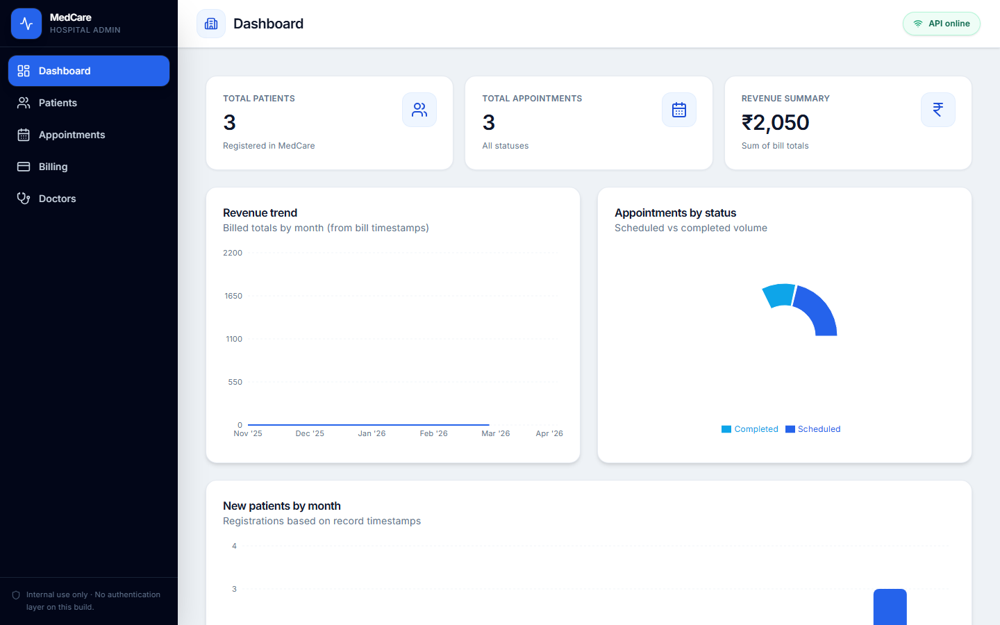
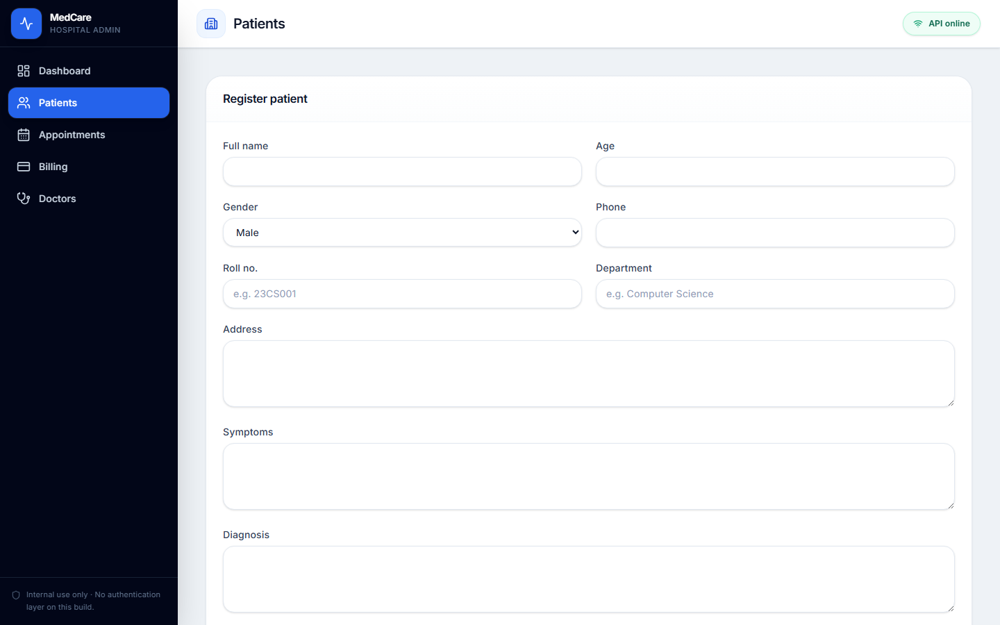
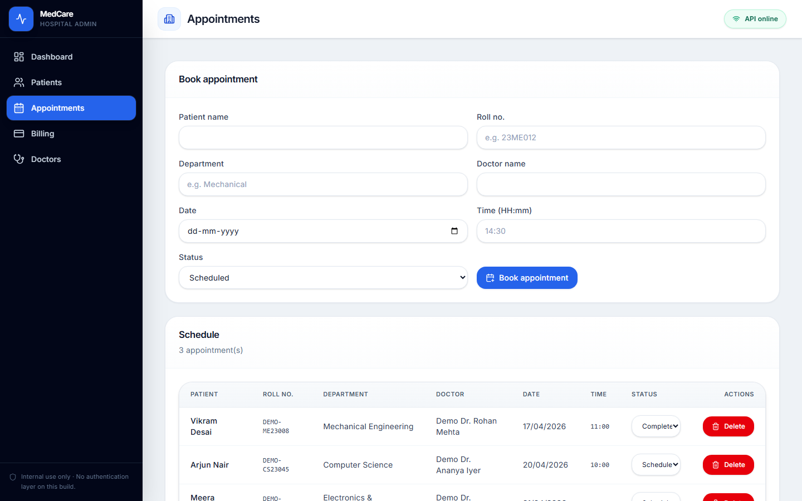

# MedCare

MedCare is a **college dispensary** web application for managing student and teacher health services: patient visits, appointments, a free-care cost ledger, medicine inventory, and medical staff. Everyone in college (students and teachers) can log in to view their own visits and book appointments; dispensary staff run the ledger and inventory; doctors manage clinical records; admins manage the college members directory.

This repository is a learning and demonstration project.

## Features

- **Four login roles (JWT)** — each role sees only what it can do:
  - **Admin** — everything, including the college members directory.
  - **Doctor** — clinical + operational: view/edit patient diagnosis and prescriptions, complete appointments, manage inventory. No members directory, billing, or reports.
  - **Staff** (dispensary) — patients, appointments, the free-care cost ledger, inventory, reports, doctors.
  - **Member** (student or teacher) — self-service: own visits (diagnosis + past medications, Rx & certificate PDFs), self-book and cancel own appointments, own dashboard.
- **College members directory** — admins add or import members (`category: student | teacher`). Students use 7-digit roll numbers (e.g. `2337373`); teachers use `EMP-…` codes. College IDs auto-fill patient and dispensary forms, and unrecognized IDs are rejected when saving visits.
- **Member self-registration** — students and teachers create their own login account with their college ID, validated against the members directory.
- **Patient registration** — structured prescriptions with medicines + dosage, prescription PDF download, and a **medical certificate PDF** for excusal from classes.
- **Free-care cost ledger** — no payment status. Every dispensary issue logs the items dispensed and the cost borne by the dispensary, with a voucher PDF.
- **Medicine inventory** — stock levels, unit cost, reorder levels, low-stock alerts, and automatic stock deduction when items are dispensed.
- **Appointments** — scheduling with status updates, member self-booking, and doctor availability.
- **Reports & dashboard** — patient volume, dispensary cost trend by month, cost by department, top dispensed medicines, low-stock alerts, and recent activity. Dashboards adapt to the signed-in role.
- REST API backed by MongoDB with consistent JSON responses.

## Screenshots

The images below were captured from a running MedCare UI after [demo data](#demo-data-for-testing) was loaded.

| Dashboard | Patients |
| :---: | :---: |
|  |  |

| Appointments | Dispensary |
| :---: | :---: |
|  |  |

| Inventory | Reports |
| :---: | :---: |
|  |  |

> Note: screenshots predate the authentication upgrade. Regenerate them with `npm run readme:screenshots` (see below) after logging in as `admin`.

### Regenerating screenshots

Point the capture script at any reachable URL (local Vite dev server, preview, or a deployed site):

```bash
cd client
npm install
npx playwright install chromium
cd server
npm run seed:demo
```

In one terminal, run the API (`cd server && npm run dev`) and the client (`cd client && npm run dev` or `npm run preview` after a build). Then:

```bash
cd client
# Default is http://localhost:5173 — override if Vite picked another port or you use production.
npm run readme:screenshots
```

Override the base URL when needed:

- **cmd.exe:** `set MEDCARE_SCREENSHOT_URL=http://localhost:5174`
- **PowerShell:** `$env:MEDCARE_SCREENSHOT_URL="https://your-live-site.example"`
- **macOS / Linux:** `export MEDCARE_SCREENSHOT_URL=https://your-live-site.example`

Files are written to `docs/screenshots/`.

## Architecture

| Layer | Technology |
| --- | --- |
| Client | React 19, React Router 7, Vite 8, Tailwind CSS 4, React Hook Form, Zod, Axios, Recharts |
| Server | Node.js (ES modules), Express 4, Mongoose 8, JSON Web Tokens, bcryptjs |
| Database | MongoDB (local or MongoDB Atlas) |
| Documents | PDFKit for prescription, medical certificate, and dispensary voucher PDFs |

The Vite dev server proxies `/api` to the Express API during local development.

## Repository layout

```
MedCare/
├── client/          # React SPA (Vite)
├── server/          # Express API and PDF generation
├── docs/screenshots # README UI captures (regenerate with client npm script)
└── README.md
```

Example API payloads for manual testing live under `server/examples/`.

## Demo data for testing

A seed script loads **fictional** members (students and teachers), patients, appointments, dispensary entries, medicines, doctors, and login accounts so you can exercise every screen.

- **Safe default:** only rows tagged as demo are removed before insert — patients, appointments, and dispensary entries whose college ID starts with `DEMO-` (or the demo UIDs), members with `DEMO-` UIDs, doctors whose name starts with `Demo `, and medicines from the demo list.
- **Destructive option:** `ALLOW_FULL_DB_RESET=yes npm run seed:demo -- --reset-all` deletes **all** data in the connected database (use only on a disposable database).

```bash
cd server
npm install
npm run seed:demo
```

Demo login accounts (UID / password):

| Role | UID | Password |
| --- | --- | --- |
| Admin | `admin` | `admin123` |
| Doctor | `DR-2301` | `doctor123` |
| Staff | `staff` | `staff123` |
| Student (member) | `2337373` | `student123` |
| Teacher (member) | `EMP-1001` | `teacher123` |

After seeding, look for 7-digit roll numbers such as `2337373`, `2337374`, and `2337375`, plus the teacher code `EMP-1001`. Log in as **admin** to register visits, record dispensary issues (stock is deducted automatically), and download prescription / certificate / voucher PDFs. Log in as a **student** or **teacher** to see self-service features, or as **DR-2301** for the doctor experience.

## Prerequisites

- Node.js 20 or newer recommended
- A MongoDB instance (local installation or Atlas cluster) and a connection URI

## Configuration

Copy `server/.env.example` to `server/.env` and set variables as needed.

| Variable | Required | Description |
| --- | --- | --- |
| `MONGODB_URI` | Yes | MongoDB connection string |
| `JWT_SECRET` | Yes | Secret used to sign login tokens (any long random string) |
| `PORT` | No | API port (default `5000`) |
| `CLIENT_ORIGIN` | No | Allowed browser origin for CORS in production (e.g. your deployed frontend URL) |
| `BILL_LOGO_PATH` | No | Absolute path to a PNG or JPEG used on PDFs; if unset, a vector mark is drawn |
| `MEDCARE_WEBSITE` | No | Shown on PDF footers |
| `MEDCARE_PHONE` | No | Shown on PDF footers |
| `MEDCARE_ADDRESS` | No | Shown on PDF footers |

Optional artwork can also be placed at `server/assets/bill-logo.png` if you prefer not to use `BILL_LOGO_PATH`.

## Local development

### API

```bash
cd server
npm install
npm run dev
```

The API listens on `http://localhost:5000` by default. Health check: `GET http://localhost:5000/api/health`.

If MongoDB is unreachable, the process still starts; data routes respond with service unavailable until the database connects.

### Client

```bash
cd client
npm install
npm run dev
```

The UI defaults to `http://localhost:5173` with `/api` proxied to port 5000.

### Production build (client only)

```bash
cd client
npm run build
npm run preview
```

Serving the built SPA from the same Express process is not configured in this repository; for production you typically deploy the static build to a CDN or static host and point it at your deployed API, or extend the server to serve `client/dist` and align CORS accordingly.

## HTTP API summary

Base path: `/api`. Resource routes require a `Authorization: Bearer <token>` header; `/api/auth/login` is public.

| Resource | Endpoints | Access |
| --- | --- | --- |
| Health | `GET /api/health` | Public |
| Auth | `POST /api/auth/login`; `POST /api/auth/register`; `GET /api/auth/me`; `PATCH /api/auth/password` | register: public (member self-signup, validated against the directory); me/password: any logged-in user |
| Patients | `GET`, `POST /api/patients`; `GET`, `PATCH`, `DELETE /api/patients/:id`; `GET /api/patients/:id/prescription.pdf`; `GET /api/patients/:id/certificate.pdf` | GET/PDFs: any logged-in (members scoped to own); create/delete/full update: staff, admin; clinical update (diagnosis + medicines): doctor |
| Appointments | `GET`, `POST /api/appointments`; `PATCH /api/appointments/:id/status`; `DELETE /api/appointments/:id` | GET: any logged-in (members scoped to own); POST: staff/admin book anyone, members self-book; status: staff, admin, doctor; DELETE: staff/admin, members cancel only their own |
| Dispensary (bills) | `GET`, `POST /api/bills`; `GET /api/bills/:id`; `GET /api/bills/:id/pdf` | staff, admin |
| Members | `GET`, `POST /api/members`; `PATCH`, `DELETE /api/members/:id`; `POST /api/members/import`; `GET /api/members/lookup` | admin |
| Medicines | `GET`, `POST /api/medicines`; `PATCH`, `DELETE /api/medicines/:id`; `POST /api/medicines/:id/stock` | staff, admin, doctor |
| Doctors | `GET`, `POST /api/doctors` | any logged-in user |

Consult `server/examples/MedCare.postman_collection.json` for sample requests.